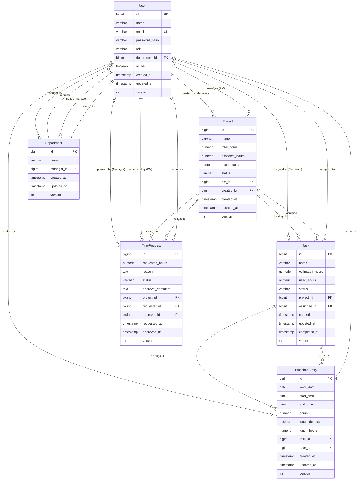

# 資料模型設計文件

**專案**: 工時管理系統  
**技術棧**: JDK 21 + Spring Boot 3.2 + PostgreSQL 14+  
**建立日期**: 2026年2月6日  
**版本**: 1.0

---

## 目錄

1. [概述](#概述)
2. [實體關係圖](#實體關係圖)
3. [核心實體設計](#核心實體設計)
4. [資料庫表結構](#資料庫表結構)
5. [樂觀鎖定機制](#樂觀鎖定機制)
6. [索引策略](#索引策略)
7. [資料驗證規則](#資料驗證規則)

---

## 概述

本文件定義工時管理系統的完整資料模型，包含六個核心實體及其關聯關係。系統採用 JPA/Hibernate 作為 ORM 框架，PostgreSQL 作為持久化儲存。

### 設計原則

- **正規化設計**: 符合第三正規化 (3NF)，避免資料冗餘
- **樂觀鎖定**: 所有可編輯實體使用 `@Version` 防止並發衝突
- **軟刪除**: 關鍵實體支援軟刪除，保留歷史資料
- **審計追蹤**: 記錄建立時間、修改時間、操作人員
- **型別安全**: 使用 Enum 定義狀態與角色，避免魔術字串

---

## 實體關係圖



---

## 核心實體設計

### 1. User (用戶)

**職責**: 代表系統使用者，支援五種角色（管理層、PM、部門主管、執行人員、HR）

**JPA Entity**:

```java
package com.example.timesheet.domain.entity;

import jakarta.persistence.*;
import jakarta.validation.constraints.*;
import lombok.*;
import org.springframework.security.core.GrantedAuthority;
import org.springframework.security.core.authority.SimpleGrantedAuthority;
import org.springframework.security.core.userdetails.UserDetails;

import java.time.LocalDateTime;
import java.util.*;

@Entity
@Table(name = "users", indexes = {
    @Index(name = "idx_user_email", columnList = "email", unique = true),
    @Index(name = "idx_user_department", columnList = "department_id"),
    @Index(name = "idx_user_role", columnList = "role")
})
@Data
@Builder
@NoArgsConstructor
@AllArgsConstructor
@EqualsAndHashCode(of = "id")
public class User implements UserDetails {
    
    @Id
    @GeneratedValue(strategy = GenerationType.IDENTITY)
    private Long id;
    
    /**
     * User's full name (e.g., "張三", "李四")
     */
    @Column(nullable = false, length = 100)
    @NotBlank(message = "姓名不可為空")
    @Size(min = 2, max = 100, message = "姓名長度必須在 2-100 字元之間")
    private String name;
    
    /**
     * User's email address (unique identifier for login)
     */
    @Column(nullable = false, unique = true, length = 255)
    @NotBlank(message = "電子郵件不可為空")
    @Email(message = "電子郵件格式不正確")
    private String email;
    
    /**
     * BCrypt hashed password
     */
    @Column(name = "password_hash", nullable = false, length = 255)
    @NotBlank(message = "密碼不可為空")
    private String passwordHash;
    
    /**
     * User's role in the system
     */
    @Enumerated(EnumType.STRING)
    @Column(nullable = false, length = 20)
    @NotNull(message = "角色不可為空")
    private UserRole role;
    
    /**
     * User's department
     */
    @ManyToOne(fetch = FetchType.LAZY)
    @JoinColumn(name = "department_id")
    private Department department;
    
    /**
     * Account activation status (true = enabled, false = disabled)
     */
    @Column(nullable = false)
    @Builder.Default
    private Boolean active = true;
    
    /**
     * Record creation timestamp
     */
    @Column(name = "created_at", nullable = false, updatable = false)
    @Builder.Default
    private LocalDateTime createdAt = LocalDateTime.now();
    
    /**
     * Last update timestamp
     */
    @Column(name = "updated_at", nullable = false)
    @Builder.Default
    private LocalDateTime updatedAt = LocalDateTime.now();
    
    /**
     * Optimistic locking version
     */
    @Version
    @Column(nullable = false)
    @Builder.Default
    private Integer version = 0;
    
    // ========== Relationships ==========
    
    @OneToMany(mappedBy = "assignee", cascade = CascadeType.ALL)
    private List<Task> assignedTasks = new ArrayList<>();
    
    @OneToMany(mappedBy = "user", cascade = CascadeType.ALL)
    private List<TimesheetEntry> timesheetEntries = new ArrayList<>();
    
    @OneToMany(mappedBy = "pm", cascade = CascadeType.ALL)
    private List<Project> managedProjects = new ArrayList<>();
    
    @OneToMany(mappedBy = "requester", cascade = CascadeType.ALL)
    private List<TimeRequest> timeRequests = new ArrayList<>();
    
    // ========== UserDetails Implementation ==========
    
    @Override
    public Collection<? extends GrantedAuthority> getAuthorities() {
        return Collections.singletonList(
            new SimpleGrantedAuthority("ROLE_" + role.name())
        );
    }
    
    @Override
    public String getPassword() {
        return passwordHash;
    }
    
    @Override
    public String getUsername() {
        return email;
    }
    
    @Override
    public boolean isAccountNonExpired() {
        return true;
    }
    
    @Override
    public boolean isAccountNonLocked() {
        return active;
    }
    
    @Override
    public boolean isCredentialsNonExpired() {
        return true;
    }
    
    @Override
    public boolean isEnabled() {
        return active;
    }
    
    // ========== Lifecycle Callbacks ==========
    
    @PreUpdate
    protected void onUpdate() {
        this.updatedAt = LocalDateTime.now();
    }
}
```

**UserRole Enum**:

```java
package com.example.timesheet.domain.enums;

public enum UserRole {
    /**
     * 管理層 - Can create/modify/close projects, approve time requests
     */
    MANAGER,
    
    /**
     * 專案經理 - Can create/modify tasks, request additional hours
     */
    PM,
    
    /**
     * 部門主管 - Can view department members' timesheets
     */
    DEPT_HEAD,
    
    /**
     * 執行人員 - Can log timesheets, mark tasks as completed
     */
    EXECUTIVE,
    
    /**
     * 人力資源 - Can manage users, assign roles
     */
    HR
}
```

---

### 2. Department (部門)

**職責**: 組織部門結構，關聯部門主管與成員

**JPA Entity**:

```java
package com.example.timesheet.domain.entity;

import jakarta.persistence.*;
import jakarta.validation.constraints.*;
import lombok.*;

import java.time.LocalDateTime;
import java.util.ArrayList;
import java.util.List;

@Entity
@Table(name = "departments", indexes = {
    @Index(name = "idx_department_name", columnList = "name")
})
@Data
@Builder
@NoArgsConstructor
@AllArgsConstructor
@EqualsAndHashCode(of = "id")
public class Department {
    
    @Id
    @GeneratedValue(strategy = GenerationType.IDENTITY)
    private Long id;
    
    /**
     * Department name (e.g., "研發部", "銷售部")
     */
    @Column(nullable = false, length = 100)
    @NotBlank(message = "部門名稱不可為空")
    @Size(min = 2, max = 100, message = "部門名稱長度必須在 2-100 字元之間")
    private String name;
    
    /**
     * Department manager (DEPT_HEAD role)
     */
    @ManyToOne(fetch = FetchType.LAZY)
    @JoinColumn(name = "manager_id")
    private User manager;
    
    @Column(name = "created_at", nullable = false, updatable = false)
    @Builder.Default
    private LocalDateTime createdAt = LocalDateTime.now();
    
    @Column(name = "updated_at", nullable = false)
    @Builder.Default
    private LocalDateTime updatedAt = LocalDateTime.now();
    
    @Version
    @Column(nullable = false)
    @Builder.Default
    private Integer version = 0;
    
    // ========== Relationships ==========
    
    @OneToMany(mappedBy = "department", cascade = CascadeType.ALL)
    private List<User> members = new ArrayList<>();
    
    @PreUpdate
    protected void onUpdate() {
        this.updatedAt = LocalDateTime.now();
    }
}
```

---

### 3. Project (專案)

**職責**: 代表工作專案，管理總時數、已分配時數、已使用時數

**JPA Entity**:

```java
package com.example.timesheet.domain.entity;

import jakarta.persistence.*;
import jakarta.validation.constraints.*;
import lombok.*;

import java.math.BigDecimal;
import java.time.LocalDateTime;
import java.util.ArrayList;
import java.util.List;

@Entity
@Table(name = "projects", indexes = {
    @Index(name = "idx_project_pm", columnList = "pm_id"),
    @Index(name = "idx_project_status", columnList = "status"),
    @Index(name = "idx_project_created_by", columnList = "created_by")
})
@Data
@Builder
@NoArgsConstructor
@AllArgsConstructor
@EqualsAndHashCode(of = "id")
public class Project {
    
    @Id
    @GeneratedValue(strategy = GenerationType.IDENTITY)
    private Long id;
    
    /**
     * Project name (e.g., "電商平台改版")
     */
    @Column(nullable = false, length = 200)
    @NotBlank(message = "專案名稱不可為空")
    @Size(min = 2, max = 200, message = "專案名稱長度必須在 2-200 字元之間")
    private String name;
    
    @Column(length = 1000)
    @Size(max = 1000, message = "專案描述不可超過 1000 字元")
    private String description;
    
    /**
     * Total budgeted hours for the project
     */
    @Column(name = "total_hours", nullable = false, precision = 10, scale = 2)
    @NotNull(message = "總時數不可為空")
    @DecimalMin(value = "0.0", message = "總時數不可為負數")
    @Builder.Default
    private BigDecimal totalHours = BigDecimal.ZERO;
    
    /**
     * Hours already allocated to tasks
     * Calculated as SUM(task.estimatedHours) for all tasks
     */
    @Column(name = "allocated_hours", nullable = false, precision = 10, scale = 2)
    @Builder.Default
    private BigDecimal allocatedHours = BigDecimal.ZERO;
    
    /**
     * Hours actually used (logged in timesheets)
     * Calculated as SUM(timesheetEntry.hours) for all tasks
     */
    @Column(name = "used_hours", nullable = false, precision = 10, scale = 2)
    @Builder.Default
    private BigDecimal usedHours = BigDecimal.ZERO;
    
    /**
     * Project status
     */
    @Enumerated(EnumType.STRING)
    @Column(nullable = false, length = 20)
    @NotNull(message = "專案狀態不可為空")
    @Builder.Default
    private ProjectStatus status = ProjectStatus.ACTIVE;
    
    /**
     * Project Manager assigned to this project
     */
    @ManyToOne(fetch = FetchType.LAZY)
    @JoinColumn(name = "pm_id", nullable = false)
    @NotNull(message = "專案經理不可為空")
    private User pm;
    
    /**
     * Manager who created this project
     */
    @ManyToOne(fetch = FetchType.LAZY)
    @JoinColumn(name = "created_by", nullable = false)
    @NotNull(message = "建立人不可為空")
    private User createdBy;
    
    @Column(name = "created_at", nullable = false, updatable = false)
    @Builder.Default
    private LocalDateTime createdAt = LocalDateTime.now();
    
    @Column(name = "updated_at", nullable = false)
    @Builder.Default
    private LocalDateTime updatedAt = LocalDateTime.now();
    
    @Version
    @Column(nullable = false)
    @Builder.Default
    private Integer version = 0;
    
    // ========== Relationships ==========
    
    @OneToMany(mappedBy = "project", cascade = CascadeType.ALL, orphanRemoval = true)
    private List<Task> tasks = new ArrayList<>();
    
    @OneToMany(mappedBy = "project", cascade = CascadeType.ALL)
    private List<TimeRequest> timeRequests = new ArrayList<>();
    
    // ========== Business Methods ==========
    
    /**
     * Calculate remaining available hours = totalHours - allocatedHours
     */
    public BigDecimal getRemainingHours() {
        return totalHours.subtract(allocatedHours);
    }
    
    /**
     * Check if project has enough hours to allocate
     */
    public boolean hasEnoughHours(BigDecimal hoursToAllocate) {
        return getRemainingHours().compareTo(hoursToAllocate) >= 0;
    }
    
    /**
     * Check if project is active (can create tasks and log timesheets)
     */
    public boolean isActive() {
        return status == ProjectStatus.ACTIVE;
    }
    
    @PreUpdate
    protected void onUpdate() {
        this.updatedAt = LocalDateTime.now();
    }
}
```

**ProjectStatus Enum**:

```java
package com.example.timesheet.domain.enums;

public enum ProjectStatus {
    /**
     * 進行中 - Active project, can create tasks and log timesheets
     */
    ACTIVE,
    
    /**
     * 已關閉 - Closed project, cannot create new tasks or log timesheets
     */
    CLOSED
}
```

---

### 4. Task (任務)

**職責**: 代表專案下的具體工作項目，追蹤預估時數與已使用時數

**JPA Entity**:

```java
package com.example.timesheet.domain.entity;

import jakarta.persistence.*;
import jakarta.validation.constraints.*;
import lombok.*;

import java.math.BigDecimal;
import java.time.LocalDateTime;
import java.util.ArrayList;
import java.util.List;

@Entity
@Table(name = "tasks", indexes = {
    @Index(name = "idx_task_project", columnList = "project_id"),
    @Index(name = "idx_task_assignee", columnList = "assignee_id"),
    @Index(name = "idx_task_status", columnList = "status")
})
@Data
@Builder
@NoArgsConstructor
@AllArgsConstructor
@EqualsAndHashCode(of = "id")
public class Task {
    
    @Id
    @GeneratedValue(strategy = GenerationType.IDENTITY)
    private Long id;
    
    /**
     * Task name (e.g., "開發登入功能")
     */
    @Column(nullable = false, length = 200)
    @NotBlank(message = "任務名稱不可為空")
    @Size(min = 2, max = 200, message = "任務名稱長度必須在 2-200 字元之間")
    private String name;
    
    @Column(length = 2000)
    @Size(max = 2000, message = "任務描述不可超過 2000 字元")
    private String description;
    
    /**
     * Estimated hours allocated to this task by PM
     */
    @Column(name = "estimated_hours", nullable = false, precision = 10, scale = 2)
    @NotNull(message = "預估時數不可為空")
    @DecimalMin(value = "0.5", message = "預估時數最小為 0.5 小時")
    private BigDecimal estimatedHours;
    
    /**
     * Hours actually used (sum of timesheet entries)
     */
    @Column(name = "used_hours", nullable = false, precision = 10, scale = 2)
    @Builder.Default
    private BigDecimal usedHours = BigDecimal.ZERO;
    
    /**
     * Task status
     */
    @Enumerated(EnumType.STRING)
    @Column(nullable = false, length = 20)
    @NotNull(message = "任務狀態不可為空")
    @Builder.Default
    private TaskStatus status = TaskStatus.PENDING;
    
    /**
     * Project this task belongs to
     */
    @ManyToOne(fetch = FetchType.LAZY)
    @JoinColumn(name = "project_id", nullable = false)
    @NotNull(message = "所屬專案不可為空")
    private Project project;
    
    /**
     * Executive user assigned to complete this task
     */
    @ManyToOne(fetch = FetchType.LAZY)
    @JoinColumn(name = "assignee_id", nullable = false)
    @NotNull(message = "負責人不可為空")
    private User assignee;
    
    @Column(name = "created_at", nullable = false, updatable = false)
    @Builder.Default
    private LocalDateTime createdAt = LocalDateTime.now();
    
    @Column(name = "updated_at", nullable = false)
    @Builder.Default
    private LocalDateTime updatedAt = LocalDateTime.now();
    
    /**
     * Task completion timestamp (null if not completed)
     */
    @Column(name = "completed_at")
    private LocalDateTime completedAt;
    
    @Version
    @Column(nullable = false)
    @Builder.Default
    private Integer version = 0;
    
    // ========== Relationships ==========
    
    @OneToMany(mappedBy = "task", cascade = CascadeType.ALL, orphanRemoval = true)
    private List<TimesheetEntry> timesheetEntries = new ArrayList<>();
    
    // ========== Business Methods ==========
    
    /**
     * Calculate remaining hours = estimatedHours - usedHours
     */
    public BigDecimal getRemainingHours() {
        return estimatedHours.subtract(usedHours);
    }
    
    /**
     * Check if task has enough hours remaining
     */
    public boolean hasEnoughHours(BigDecimal hoursToUse) {
        return getRemainingHours().compareTo(hoursToUse) >= 0;
    }
    
    /**
     * Mark task as completed
     */
    public void markAsCompleted() {
        this.status = TaskStatus.COMPLETED;
        this.completedAt = LocalDateTime.now();
    }
    
    /**
     * Check if task can be deleted (no timesheet entries)
     */
    public boolean canBeDeleted() {
        return timesheetEntries == null || timesheetEntries.isEmpty();
    }
    
    @PreUpdate
    protected void onUpdate() {
        this.updatedAt = LocalDateTime.now();
    }
}
```

**TaskStatus Enum**:

```java
package com.example.timesheet.domain.enums;

public enum TaskStatus {
    /**
     * 待開始 - Task created but not started yet
     */
    PENDING,
    
    /**
     * 進行中 - Task is being worked on
     */
    IN_PROGRESS,
    
    /**
     * 已完成 - Task completed (may have remaining hours)
     */
    COMPLETED
}
```

---

### 5. TimesheetEntry (工時記錄)

**職責**: 記錄執行人員的工時填報，自動計算工時並扣除午休時間

**JPA Entity**:

```java
package com.example.timesheet.domain.entity;

import jakarta.persistence.*;
import jakarta.validation.constraints.*;
import lombok.*;

import java.math.BigDecimal;
import java.time.LocalDate;
import java.time.LocalDateTime;
import java.time.LocalTime;

@Entity
@Table(name = "timesheet_entries", indexes = {
    @Index(name = "idx_timesheet_task", columnList = "task_id"),
    @Index(name = "idx_timesheet_user", columnList = "user_id"),
    @Index(name = "idx_timesheet_date", columnList = "work_date"),
    @Index(name = "idx_timesheet_user_date", columnList = "user_id, work_date")
})
@Data
@Builder
@NoArgsConstructor
@AllArgsConstructor
@EqualsAndHashCode(of = "id")
public class TimesheetEntry {
    
    @Id
    @GeneratedValue(strategy = GenerationType.IDENTITY)
    private Long id;
    
    /**
     * Work date (cannot be future date)
     */
    @Column(name = "work_date", nullable = false)
    @NotNull(message = "工作日期不可為空")
    @PastOrPresent(message = "工作日期不可為未來日期")
    private LocalDate workDate;
    
    /**
     * Work start time
     */
    @Column(name = "start_time", nullable = false)
    @NotNull(message = "起始時間不可為空")
    private LocalTime startTime;
    
    /**
     * Work end time
     */
    @Column(name = "end_time", nullable = false)
    @NotNull(message = "結束時間不可為空")
    private LocalTime endTime;
    
    /**
     * Calculated work hours (in 0.5 hour increments)
     */
    @Column(nullable = false, precision = 10, scale = 2)
    @NotNull(message = "工時不可為空")
    @DecimalMin(value = "0.5", message = "工時最小為 0.5 小時")
    @DecimalMax(value = "24.0", message = "工時不可超過 24 小時")
    private BigDecimal hours;
    
    /**
     * Whether lunch time (12:00-13:00) was automatically deducted
     */
    @Column(name = "lunch_deducted", nullable = false)
    @Builder.Default
    private Boolean lunchDeducted = false;
    
    /**
     * Actual lunch hours deducted (0.0 to 1.0)
     */
    @Column(name = "lunch_hours", precision = 10, scale = 2)
    @Builder.Default
    private BigDecimal lunchHours = BigDecimal.ZERO;
    
    /**
     * Task this timesheet entry belongs to
     */
    @ManyToOne(fetch = FetchType.LAZY)
    @JoinColumn(name = "task_id", nullable = false)
    @NotNull(message = "所屬任務不可為空")
    private Task task;
    
    /**
     * User who logged this timesheet entry
     */
    @ManyToOne(fetch = FetchType.LAZY)
    @JoinColumn(name = "user_id", nullable = false)
    @NotNull(message = "填報人不可為空")
    private User user;
    
    @Column(name = "created_at", nullable = false, updatable = false)
    @Builder.Default
    private LocalDateTime createdAt = LocalDateTime.now();
    
    @Column(name = "updated_at", nullable = false)
    @Builder.Default
    private LocalDateTime updatedAt = LocalDateTime.now();
    
    @Version
    @Column(nullable = false)
    @Builder.Default
    private Integer version = 0;
    
    // ========== Business Methods ==========
    
    /**
     * Check if this entry can be edited (within 3 working days)
     * Working days are calculated excluding weekends
     */
    public boolean canBeEdited(LocalDate currentDate) {
        // Simple implementation: allow editing within 7 calendar days
        // Real implementation should consider business days and holidays
        long daysDiff = java.time.temporal.ChronoUnit.DAYS.between(workDate, currentDate);
        return daysDiff <= 7;
    }
    
    @PreUpdate
    protected void onUpdate() {
        this.updatedAt = LocalDateTime.now();
    }
}
```

---

### 6. TimeRequest (時數申請)

**職責**: PM 向管理層申請增加專案時數的記錄

**JPA Entity**:

```java
package com.example.timesheet.domain.entity;

import jakarta.persistence.*;
import jakarta.validation.constraints.*;
import lombok.*;

import java.math.BigDecimal;
import java.time.LocalDateTime;

@Entity
@Table(name = "time_requests", indexes = {
    @Index(name = "idx_time_request_project", columnList = "project_id"),
    @Index(name = "idx_time_request_requester", columnList = "requester_id"),
    @Index(name = "idx_time_request_status", columnList = "status")
})
@Data
@Builder
@NoArgsConstructor
@AllArgsConstructor
@EqualsAndHashCode(of = "id")
public class TimeRequest {
    
    @Id
    @GeneratedValue(strategy = GenerationType.IDENTITY)
    private Long id;
    
    /**
     * Number of hours requested to be added to the project
     */
    @Column(name = "requested_hours", nullable = false, precision = 10, scale = 2)
    @NotNull(message = "申請時數不可為空")
    @DecimalMin(value = "0.5", message = "申請時數最小為 0.5 小時")
    private BigDecimal requestedHours;
    
    /**
     * Reason for requesting additional hours
     */
    @Column(nullable = false, length = 2000)
    @NotBlank(message = "申請原因不可為空")
    @Size(min = 10, max = 2000, message = "申請原因長度必須在 10-2000 字元之間")
    private String reason;
    
    /**
     * Request status
     */
    @Enumerated(EnumType.STRING)
    @Column(nullable = false, length = 20)
    @NotNull(message = "申請狀態不可為空")
    @Builder.Default
    private TimeRequestStatus status = TimeRequestStatus.PENDING;
    
    /**
     * Manager's comment when approving/rejecting
     */
    @Column(name = "approval_comment", length = 2000)
    @Size(max = 2000, message = "審批意見不可超過 2000 字元")
    private String approvalComment;
    
    /**
     * Project this request belongs to
     */
    @ManyToOne(fetch = FetchType.LAZY)
    @JoinColumn(name = "project_id", nullable = false)
    @NotNull(message = "所屬專案不可為空")
    private Project project;
    
    /**
     * PM who submitted this request
     */
    @ManyToOne(fetch = FetchType.LAZY)
    @JoinColumn(name = "requester_id", nullable = false)
    @NotNull(message = "申請人不可為空")
    private User requester;
    
    /**
     * Manager who approved/rejected this request
     */
    @ManyToOne(fetch = FetchType.LAZY)
    @JoinColumn(name = "approver_id")
    private User approver;
    
    @Column(name = "requested_at", nullable = false, updatable = false)
    @Builder.Default
    private LocalDateTime requestedAt = LocalDateTime.now();
    
    /**
     * Timestamp when request was approved/rejected
     */
    @Column(name = "approved_at")
    private LocalDateTime approvedAt;
    
    @Version
    @Column(nullable = false)
    @Builder.Default
    private Integer version = 0;
    
    // ========== Business Methods ==========
    
    /**
     * Approve this request
     */
    public void approve(User manager, String comment) {
        this.status = TimeRequestStatus.APPROVED;
        this.approver = manager;
        this.approvalComment = comment;
        this.approvedAt = LocalDateTime.now();
    }
    
    /**
     * Reject this request
     */
    public void reject(User manager, String comment) {
        this.status = TimeRequestStatus.REJECTED;
        this.approver = manager;
        this.approvalComment = comment;
        this.approvedAt = LocalDateTime.now();
    }
    
    public boolean isPending() {
        return status == TimeRequestStatus.PENDING;
    }
}
```

**TimeRequestStatus Enum**:

```java
package com.example.timesheet.domain.enums;

public enum TimeRequestStatus {
    /**
     * 待審批 - Request submitted, pending manager approval
     */
    PENDING,
    
    /**
     * 已批准 - Request approved, hours added to project
     */
    APPROVED,
    
    /**
     * 已拒絕 - Request rejected by manager
     */
    REJECTED
}
```

---

## 資料庫表結構

### DDL Schema (PostgreSQL)

```sql
-- ========== Users Table ==========
CREATE TABLE users (
    id BIGSERIAL PRIMARY KEY,
    name VARCHAR(100) NOT NULL,
    email VARCHAR(255) UNIQUE NOT NULL,
    password_hash VARCHAR(255) NOT NULL,
    role VARCHAR(20) NOT NULL CHECK (role IN ('MANAGER', 'PM', 'DEPT_HEAD', 'EXECUTIVE', 'HR')),
    department_id BIGINT REFERENCES departments(id),
    active BOOLEAN NOT NULL DEFAULT TRUE,
    created_at TIMESTAMP NOT NULL DEFAULT CURRENT_TIMESTAMP,
    updated_at TIMESTAMP NOT NULL DEFAULT CURRENT_TIMESTAMP,
    version INTEGER NOT NULL DEFAULT 0
);

CREATE INDEX idx_user_email ON users(email);
CREATE INDEX idx_user_department ON users(department_id);
CREATE INDEX idx_user_role ON users(role);

-- ========== Departments Table ==========
CREATE TABLE departments (
    id BIGSERIAL PRIMARY KEY,
    name VARCHAR(100) NOT NULL,
    manager_id BIGINT REFERENCES users(id),
    created_at TIMESTAMP NOT NULL DEFAULT CURRENT_TIMESTAMP,
    updated_at TIMESTAMP NOT NULL DEFAULT CURRENT_TIMESTAMP,
    version INTEGER NOT NULL DEFAULT 0
);

CREATE INDEX idx_department_name ON departments(name);

-- ========== Projects Table ==========
CREATE TABLE projects (
    id BIGSERIAL PRIMARY KEY,
    name VARCHAR(200) NOT NULL,
    description VARCHAR(1000),
    total_hours NUMERIC(10,2) NOT NULL DEFAULT 0,
    allocated_hours NUMERIC(10,2) NOT NULL DEFAULT 0,
    used_hours NUMERIC(10,2) NOT NULL DEFAULT 0,
    status VARCHAR(20) NOT NULL CHECK (status IN ('ACTIVE', 'CLOSED')) DEFAULT 'ACTIVE',
    pm_id BIGINT NOT NULL REFERENCES users(id),
    created_by BIGINT NOT NULL REFERENCES users(id),
    created_at TIMESTAMP NOT NULL DEFAULT CURRENT_TIMESTAMP,
    updated_at TIMESTAMP NOT NULL DEFAULT CURRENT_TIMESTAMP,
    version INTEGER NOT NULL DEFAULT 0
);

CREATE INDEX idx_project_pm ON projects(pm_id);
CREATE INDEX idx_project_status ON projects(status);
CREATE INDEX idx_project_created_by ON projects(created_by);

-- ========== Tasks Table ==========
CREATE TABLE tasks (
    id BIGSERIAL PRIMARY KEY,
    name VARCHAR(200) NOT NULL,
    description VARCHAR(2000),
    estimated_hours NUMERIC(10,2) NOT NULL CHECK (estimated_hours >= 0.5),
    used_hours NUMERIC(10,2) NOT NULL DEFAULT 0,
    status VARCHAR(20) NOT NULL CHECK (status IN ('PENDING', 'IN_PROGRESS', 'COMPLETED')) DEFAULT 'PENDING',
    project_id BIGINT NOT NULL REFERENCES projects(id),
    assignee_id BIGINT NOT NULL REFERENCES users(id),
    created_at TIMESTAMP NOT NULL DEFAULT CURRENT_TIMESTAMP,
    updated_at TIMESTAMP NOT NULL DEFAULT CURRENT_TIMESTAMP,
    completed_at TIMESTAMP,
    version INTEGER NOT NULL DEFAULT 0
);

CREATE INDEX idx_task_project ON tasks(project_id);
CREATE INDEX idx_task_assignee ON tasks(assignee_id);
CREATE INDEX idx_task_status ON tasks(status);

-- ========== Timesheet Entries Table ==========
CREATE TABLE timesheet_entries (
    id BIGSERIAL PRIMARY KEY,
    work_date DATE NOT NULL,
    start_time TIME NOT NULL,
    end_time TIME NOT NULL,
    hours NUMERIC(10,2) NOT NULL CHECK (hours >= 0.5 AND hours <= 24.0),
    lunch_deducted BOOLEAN NOT NULL DEFAULT FALSE,
    lunch_hours NUMERIC(10,2) DEFAULT 0,
    task_id BIGINT NOT NULL REFERENCES tasks(id),
    user_id BIGINT NOT NULL REFERENCES users(id),
    created_at TIMESTAMP NOT NULL DEFAULT CURRENT_TIMESTAMP,
    updated_at TIMESTAMP NOT NULL DEFAULT CURRENT_TIMESTAMP,
    version INTEGER NOT NULL DEFAULT 0
);

CREATE INDEX idx_timesheet_task ON timesheet_entries(task_id);
CREATE INDEX idx_timesheet_user ON timesheet_entries(user_id);
CREATE INDEX idx_timesheet_date ON timesheet_entries(work_date);
CREATE INDEX idx_timesheet_user_date ON timesheet_entries(user_id, work_date);

-- ========== Time Requests Table ==========
CREATE TABLE time_requests (
    id BIGSERIAL PRIMARY KEY,
    requested_hours NUMERIC(10,2) NOT NULL CHECK (requested_hours >= 0.5),
    reason TEXT NOT NULL,
    status VARCHAR(20) NOT NULL CHECK (status IN ('PENDING', 'APPROVED', 'REJECTED')) DEFAULT 'PENDING',
    approval_comment VARCHAR(2000),
    project_id BIGINT NOT NULL REFERENCES projects(id),
    requester_id BIGINT NOT NULL REFERENCES users(id),
    approver_id BIGINT REFERENCES users(id),
    requested_at TIMESTAMP NOT NULL DEFAULT CURRENT_TIMESTAMP,
    approved_at TIMESTAMP,
    version INTEGER NOT NULL DEFAULT 0
);

CREATE INDEX idx_time_request_project ON time_requests(project_id);
CREATE INDEX idx_time_request_requester ON time_requests(requester_id);
CREATE INDEX idx_time_request_status ON time_requests(status);
```

---

## 樂觀鎖定機制

### 原理說明

系統採用 JPA 的 `@Version` 註解實現樂觀鎖定（Optimistic Locking），防止並發修改導致的資料不一致問題。

**運作機制**：

1. 每個實體都有一個 `version` 欄位（Integer 型別）
2. 當實體第一次被持久化時，version 初始化為 0
3. 每次更新實體時，JPA 自動檢查版本號：
   ```sql
   UPDATE tasks
   SET name = ?, estimated_hours = ?, version = version + 1
   WHERE id = ? AND version = ?
   ```
4. 如果 version 不匹配（被其他交易修改），拋出 `OptimisticLockException`

### 使用場景

**場景 1：PM 修改任務，同時執行人員填報工時**

```java
// PM's transaction
Task task = taskRepository.findById(1L).orElseThrow();
task.setEstimatedHours(new BigDecimal("30.0")); // version = 0
taskRepository.save(task); // UPDATE ... WHERE version = 0 → version becomes 1

// Executive's transaction (concurrent)
Task task = taskRepository.findById(1L).orElseThrow();
task.setUsedHours(task.getUsedHours().add(new BigDecimal("3.0"))); // version = 0
taskRepository.save(task); // UPDATE ... WHERE version = 0 → FAILS (version is already 1)
// Throws OptimisticLockException
```

### 異常處理

**全域異常處理器**：

```java
@ControllerAdvice
public class GlobalExceptionHandler {
    
    @ExceptionHandler(OptimisticLockException.class)
    public ResponseEntity<ErrorResponse> handleOptimisticLock(OptimisticLockException ex) {
        return ResponseEntity
            .status(HttpStatus.CONFLICT)
            .body(ErrorResponse.builder()
                .code("OPTIMISTIC_LOCK_ERROR")
                .message("資料已被其他用戶修改，請重新載入最新資料後再試一次")
                .timestamp(LocalDateTime.now())
                .build());
    }
}
```

### 前端處理

**版本號傳遞與衝突提示**：

```typescript
// When editing, include version in request
const updateTask = async (taskId: number, updates: Partial<Task>) => {
  try {
    await api.put(`/api/tasks/${taskId}`, {
      ...updates,
      version: currentTask.version // Include current version
    })
    ElMessage.success('更新成功')
  } catch (error) {
    if (error.response?.status === 409) {
      ElMessageBox.confirm(
        '資料已被其他用戶修改，是否要重新載入最新資料？',
        '資料衝突',
        { type: 'warning' }
      ).then(() => {
        fetchLatestTask(taskId) // Reload fresh data
      })
    }
  }
}
```

---

## 索引策略

### 查詢效能優化

**索引設計原則**：

1. **外鍵索引**：所有外鍵欄位建立索引，加速 JOIN 查詢
2. **查詢條件索引**：常用查詢條件欄位（status, date, role）建立索引
3. **複合索引**：多欄位查詢建立複合索引（如 user_id + work_date）
4. **唯一索引**：唯一性約束欄位（email）建立唯一索引

### 索引清單

| 表名 | 索引名稱 | 欄位 | 類型 | 用途 |
|------|---------|------|------|------|
| users | idx_user_email | email | UNIQUE | 登入查詢、唯一性約束 |
| users | idx_user_department | department_id | NORMAL | 部門成員查詢 |
| users | idx_user_role | role | NORMAL | 角色過濾查詢 |
| projects | idx_project_pm | pm_id | NORMAL | PM 的專案列表 |
| projects | idx_project_status | status | NORMAL | 狀態過濾查詢 |
| tasks | idx_task_project | project_id | NORMAL | 專案的任務列表 |
| tasks | idx_task_assignee | assignee_id | NORMAL | 執行人員的任務列表 |
| tasks | idx_task_status | status | NORMAL | 任務狀態過濾 |
| timesheet_entries | idx_timesheet_user_date | user_id, work_date | COMPOSITE | 用戶工時查詢（最頻繁） |
| timesheet_entries | idx_timesheet_task | task_id | NORMAL | 任務的工時列表 |
| time_requests | idx_time_request_project | project_id | NORMAL | 專案的申請記錄 |
| time_requests | idx_time_request_status | status | NORMAL | 待審批申請查詢 |

### 效能測試建議

```sql
-- Explain analyze query to verify index usage
EXPLAIN ANALYZE
SELECT t.*, ts.hours
FROM tasks t
JOIN timesheet_entries ts ON ts.task_id = t.id
WHERE t.assignee_id = 1
  AND ts.work_date >= '2026-01-01'
  AND ts.work_date <= '2026-01-31';

-- Should use idx_task_assignee and idx_timesheet_date
```

---

## 資料驗證規則

### Bean Validation 註解

所有實體使用 JSR-380 Bean Validation 進行資料驗證：

| 欄位 | 驗證規則 | 錯誤訊息 |
|------|---------|---------|
| User.name | @NotBlank, @Size(2-100) | 姓名不可為空，長度 2-100 字元 |
| User.email | @NotBlank, @Email | 電子郵件格式不正確 |
| Project.totalHours | @NotNull, @DecimalMin("0.0") | 總時數不可為負數 |
| Task.estimatedHours | @NotNull, @DecimalMin("0.5") | 預估時數最小 0.5 小時 |
| TimesheetEntry.workDate | @NotNull, @PastOrPresent | 工作日期不可為未來日期 |
| TimesheetEntry.hours | @DecimalMin("0.5"), @DecimalMax("24.0") | 工時範圍 0.5-24 小時 |
| TimeRequest.reason | @NotBlank, @Size(10-2000) | 申請原因長度 10-2000 字元 |

### 業務規則驗證

**Service 層業務規則檢查**：

```java
@Service
@Transactional
public class TimesheetService {
    
    public TimesheetEntry createTimesheet(TimesheetRequest request, User currentUser) {
        Task task = taskRepository.findById(request.getTaskId())
            .orElseThrow(() -> new EntityNotFoundException("任務不存在"));
        
        // Business rule: Only assignee can log timesheets for this task
        if (!task.getAssignee().getId().equals(currentUser.getId())) {
            throw new ForbiddenException("只有任務負責人可以填報工時");
        }
        
        // Business rule: Cannot log timesheets for closed projects
        if (!task.getProject().isActive()) {
            throw new BusinessException("無法為已關閉的專案填報工時");
        }
        
        // Business rule: Cannot log future work dates
        if (request.getWorkDate().isAfter(LocalDate.now())) {
            throw new ValidationException("工作日期不可為未來日期");
        }
        
        // Business rule: Hours must be in 0.5 increments
        if (request.getHours().remainder(new BigDecimal("0.5")).compareTo(BigDecimal.ZERO) != 0) {
            throw new ValidationException("工時必須為 0.5 的倍數");
        }
        
        // Calculate and create timesheet entry
        // ...
    }
}
```

---

## 附錄：Repository 介面範例

```java
package com.example.timesheet.domain.repository;

import com.example.timesheet.domain.entity.Task;
import com.example.timesheet.domain.enums.TaskStatus;
import org.springframework.data.jpa.repository.JpaRepository;
import org.springframework.data.jpa.repository.JpaSpecificationExecutor;
import org.springframework.data.jpa.repository.Query;
import org.springframework.data.repository.query.Param;

import java.util.List;

public interface TaskRepository extends JpaRepository<Task, Long>, JpaSpecificationExecutor<Task> {
    
    /**
     * Find all tasks assigned to a specific user
     */
    List<Task> findByAssigneeId(Long assigneeId);
    
    /**
     * Find all tasks in a specific project
     */
    List<Task> findByProjectId(Long projectId);
    
    /**
     * Find tasks by status
     */
    List<Task> findByStatus(TaskStatus status);
    
    /**
     * Find tasks assigned to a user with specific status
     */
    List<Task> findByAssigneeIdAndStatus(Long assigneeId, TaskStatus status);
    
    /**
     * Find tasks in a project managed by a specific PM
     * Use JOIN FETCH to avoid N+1 query problem
     */
    @Query("SELECT t FROM Task t " +
           "JOIN FETCH t.project p " +
           "WHERE p.pm.id = :pmId")
    List<Task> findTasksByPmId(@Param("pmId") Long pmId);
    
    /**
     * Count total tasks in a project
     */
    @Query("SELECT COUNT(t) FROM Task t WHERE t.project.id = :projectId")
    Long countByProjectId(@Param("projectId") Long projectId);
}
```

---

**文件版本**: 1.0  
**最後更新**: 2026年2月6日  
**維護人員**: 後端開發團隊
