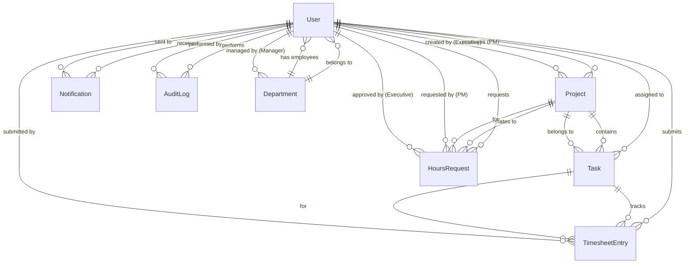

# Data Model: 報工系統角色權限管理

**Feature**: 004-timesheet-roles  
**Date**: 2026年2月6日  
**Status**: Design Phase

## Entity Relationship Overview



---

## Entities

### 1. User (使用者)

**Description**: 系統使用者，支援五種角色（EXECUTIVE, PM, MANAGER, EMPLOYEE, HR）

**Table Name**: `users`

#### Fields

| Column | Type | Constraints | Description | Validation |
|--------|------|-------------|-------------|------------|
| id | BIGSERIAL | PRIMARY KEY | 使用者唯一識別碼 | - |
| name | VARCHAR(100) | NOT NULL | 使用者姓名 | 長度 2-100 字元 |
| email | VARCHAR(255) | NOT NULL, UNIQUE | 電子郵件（登入帳號） | 有效的 email 格式 |
| password_hash | VARCHAR(255) | NOT NULL | 密碼雜湊值 | BCrypt 加密 |
| role | VARCHAR(20) | NOT NULL, CHECK | 角色類型 | 限定值: EXECUTIVE, PM, MANAGER, EMPLOYEE, HR |
| department_id | BIGINT | FOREIGN KEY | 所屬部門 | 必須存在於 departments.id（HR 和 EXECUTIVE 可為 NULL） |
| is_active | BOOLEAN | DEFAULT TRUE | 帳號狀態 | - |
| created_at | TIMESTAMP | DEFAULT NOW() | 建立時間 | 自動填入 |
| updated_at | TIMESTAMP | DEFAULT NOW() | 更新時間 | 自動更新 |
| created_by | BIGINT | FOREIGN KEY | 建立者（HR） | - |
| updated_by | BIGINT | FOREIGN KEY | 最後更新者 | - |

#### Relationships

- **ManyToOne**: Department (使用者 → 部門)
- **OneToMany**: Project (使用者 [PM] → 專案)
- **OneToMany**: Task (使用者 [EMPLOYEE] → 任務)
- **OneToMany**: TimesheetEntry (使用者 → 工時記錄)
- **OneToMany**: HoursRequest (使用者 [PM] → 時數申請)
- **OneToMany**: Notification (使用者 → 通知)
- **OneToMany**: AuditLog (使用者 → 稽核日誌)

#### Indexes

```sql
CREATE INDEX idx_users_role ON users(role);
CREATE INDEX idx_users_department ON users(department_id);
CREATE UNIQUE INDEX idx_users_email ON users(email);
CREATE INDEX idx_users_active ON users(is_active);
```

#### Business Rules

- 每個使用者僅能有一個角色
- Email 必須唯一
- EMPLOYEE 和 MANAGER 必須歸屬於一個部門
- EXECUTIVE 和 HR 可以不歸屬於任何部門
- 停用帳號時（is_active = FALSE），使用者無法登入，但歷史資料保留

#### JPA Entity

```java
@Entity
@Table(name = "users")
@EntityListeners(AuditingEntityListener.class)
public class User {
    @Id
    @GeneratedValue(strategy = GenerationType.IDENTITY)
    private Long id;

    @Column(nullable = false, length = 100)
    @Size(min = 2, max = 100, message = "姓名長度必須在 2-100 字元之間")
    private String name;

    @Column(nullable = false, unique = true)
    @Email(message = "請輸入有效的電子郵件地址")
    private String email;

    @Column(name = "password_hash", nullable = false)
    private String passwordHash;

    @Enumerated(EnumType.STRING)
    @Column(nullable = false, length = 20)
    private UserRole role;

    @ManyToOne(fetch = FetchType.LAZY)
    @JoinColumn(name = "department_id")
    private Department department;

    @Column(name = "is_active")
    private Boolean isActive = true;

    @CreatedDate
    @Column(name = "created_at", updatable = false)
    private LocalDateTime createdAt;

    @LastModifiedDate
    @Column(name = "updated_at")
    private LocalDateTime updatedAt;

    @CreatedBy
    @Column(name = "created_by")
    private Long createdBy;

    @LastModifiedBy
    @Column(name = "updated_by")
    private Long updatedBy;

    // Relationships
    @OneToMany(mappedBy = "pm", fetch = FetchType.LAZY)
    private List<Project> managedProjects;

    @OneToMany(mappedBy = "assignee", fetch = FetchType.LAZY)
    private List<Task> assignedTasks;

    @OneToMany(mappedBy = "user", fetch = FetchType.LAZY)
    private List<TimesheetEntry> timesheetEntries;
}

public enum UserRole {
    EXECUTIVE,  // 管理層
    PM,         // 專案經理
    MANAGER,    // 部門主管
    EMPLOYEE,   // 執行人員
    HR          // 人力資源
}
```

---

### 2. Department (部門)

**Description**: 組織部門

**Table Name**: `departments`

#### Fields

| Column | Type | Constraints | Description | Validation |
|--------|------|-------------|-------------|------------|
| id | BIGSERIAL | PRIMARY KEY | 部門唯一識別碼 | - |
| name | VARCHAR(100) | NOT NULL, UNIQUE | 部門名稱 | 長度 2-100 字元 |
| manager_id | BIGINT | FOREIGN KEY | 部門主管 | 必須是 MANAGER 角色 |
| description | TEXT | - | 部門描述 | - |
| created_at | TIMESTAMP | DEFAULT NOW() | 建立時間 | - |
| updated_at | TIMESTAMP | DEFAULT NOW() | 更新時間 | - |

#### Relationships

- **OneToOne**: User (部門主管)
- **OneToMany**: User (部門 → 員工)

#### Indexes

```sql
CREATE UNIQUE INDEX idx_departments_name ON departments(name);
CREATE INDEX idx_departments_manager ON departments(manager_id);
```

#### Business Rules

- 部門名稱必須唯一
- 部門主管必須是 MANAGER 角色的使用者
- 刪除部門前必須確保沒有員工歸屬於該部門

#### JPA Entity

```java
@Entity
@Table(name = "departments")
@EntityListeners(AuditingEntityListener.class)
public class Department {
    @Id
    @GeneratedValue(strategy = GenerationType.IDENTITY)
    private Long id;

    @Column(nullable = false, unique = true, length = 100)
    @Size(min = 2, max = 100, message = "部門名稱長度必須在 2-100 字元之間")
    private String name;

    @OneToOne(fetch = FetchType.LAZY)
    @JoinColumn(name = "manager_id")
    private User manager;

    @Column(columnDefinition = "TEXT")
    private String description;

    @OneToMany(mappedBy = "department", fetch = FetchType.LAZY)
    private List<User> employees;

    @CreatedDate
    @Column(name = "created_at", updatable = false)
    private LocalDateTime createdAt;

    @LastModifiedDate
    @Column(name = "updated_at")
    private LocalDateTime updatedAt;
}
```

---

### 3. Project (專案)

**Description**: 工作專案，由管理層建立並指派給 PM

**Table Name**: `projects`

#### Fields

| Column | Type | Constraints | Description | Validation |
|--------|------|-------------|-------------|------------|
| id | BIGSERIAL | PRIMARY KEY | 專案唯一識別碼 | - |
| name | VARCHAR(200) | NOT NULL | 專案名稱 | 長度 2-200 字元 |
| description | TEXT | - | 專案描述 | - |
| total_hours | DECIMAL(10,2) | NOT NULL, CHECK >= 0 | 總時數預算 | 必須 >= 0 |
| used_hours | DECIMAL(10,2) | DEFAULT 0, CHECK >= 0 | 已使用時數 | 必須 >= 0 |
| remaining_hours | DECIMAL(10,2) | GENERATED | 剩餘時數 | total_hours - used_hours |
| status | VARCHAR(20) | NOT NULL, CHECK | 專案狀態 | 限定值: ACTIVE, CLOSED |
| pm_id | BIGINT | FOREIGN KEY, NOT NULL | 指派的 PM | 必須是 PM 角色 |
| created_by | BIGINT | FOREIGN KEY | 建立者（管理層） | 必須是 EXECUTIVE 角色 |
| created_at | TIMESTAMP | DEFAULT NOW() | 建立時間 | - |
| updated_at | TIMESTAMP | DEFAULT NOW() | 更新時間 | - |
| updated_by | BIGINT | FOREIGN KEY | 最後更新者 | - |

#### Relationships

- **ManyToOne**: User (專案 → PM)
- **ManyToOne**: User (專案 → 建立者)
- **OneToMany**: Task (專案 → 任務)
- **OneToMany**: HoursRequest (專案 → 時數申請)

#### Indexes

```sql
CREATE INDEX idx_projects_pm ON projects(pm_id);
CREATE INDEX idx_projects_status ON projects(status);
CREATE INDEX idx_projects_created_by ON projects(created_by);
```

#### Business Rules

- 專案總時數必須 >= 0
- 已使用時數必須 <= 總時數（透過業務邏輯檢查）
- 剩餘時數 = 總時數 - 已使用時數（自動計算）
- 專案關閉後（CLOSED），不能再建立新任務或填報工時
- 專案轉移 PM 時，所有任務自動轉移給新 PM

#### JPA Entity

```java
@Entity
@Table(name = "projects")
@EntityListeners(AuditingEntityListener.class)
public class Project {
    @Id
    @GeneratedValue(strategy = GenerationType.IDENTITY)
    private Long id;

    @Column(nullable = false, length = 200)
    @Size(min = 2, max = 200, message = "專案名稱長度必須在 2-200 字元之間")
    private String name;

    @Column(columnDefinition = "TEXT")
    private String description;

    @Column(name = "total_hours", nullable = false, precision = 10, scale = 2)
    @DecimalMin(value = "0.0", message = "總時數必須大於等於 0")
    private BigDecimal totalHours;

    @Column(name = "used_hours", precision = 10, scale = 2)
    private BigDecimal usedHours = BigDecimal.ZERO;

    @Enumerated(EnumType.STRING)
    @Column(nullable = false, length = 20)
    private ProjectStatus status = ProjectStatus.ACTIVE;

    @ManyToOne(fetch = FetchType.LAZY)
    @JoinColumn(name = "pm_id", nullable = false)
    private User pm;

    @ManyToOne(fetch = FetchType.LAZY)
    @JoinColumn(name = "created_by")
    private User createdByUser;

    @OneToMany(mappedBy = "project", fetch = FetchType.LAZY, cascade = CascadeType.ALL)
    private List<Task> tasks = new ArrayList<>();

    @OneToMany(mappedBy = "project", fetch = FetchType.LAZY)
    private List<HoursRequest> hoursRequests = new ArrayList<>();

    @CreatedDate
    @Column(name = "created_at", updatable = false)
    private LocalDateTime createdAt;

    @LastModifiedDate
    @Column(name = "updated_at")
    private LocalDateTime updatedAt;

    @LastModifiedBy
    @Column(name = "updated_by")
    private Long updatedBy;

    // Computed field
    public BigDecimal getRemainingHours() {
        return totalHours.subtract(usedHours);
    }
}

public enum ProjectStatus {
    ACTIVE,   // 進行中
    CLOSED    // 已關閉
}
```

---

### 4. Task (任務)

**Description**: 專案下的工作項目，由 PM 建立並指派給執行人員

**Table Name**: `tasks`

#### Fields

| Column | Type | Constraints | Description | Validation |
|--------|------|-------------|-------------|------------|
| id | BIGSERIAL | PRIMARY KEY | 任務唯一識別碼 | - |
| name | VARCHAR(200) | NOT NULL | 任務名稱 | 長度 2-200 字元 |
| description | TEXT | - | 任務描述 | - |
| project_id | BIGINT | FOREIGN KEY, NOT NULL | 所屬專案 | - |
| assignee_id | BIGINT | FOREIGN KEY, NOT NULL | 指派的執行人員 | 必須是 EMPLOYEE 角色 |
| estimated_hours | DECIMAL(10,2) | NOT NULL, CHECK >= 0 | 預估時數 | 必須 >= 0 |
| used_hours | DECIMAL(10,2) | DEFAULT 0, CHECK >= 0 | 已使用時數 | 必須 >= 0 |
| remaining_hours | DECIMAL(10,2) | GENERATED | 剩餘時數 | estimated_hours - used_hours |
| status | VARCHAR(30) | NOT NULL, CHECK | 任務狀態 | 限定值: IN_PROGRESS, COMPLETED, CLOSED, PENDING_REASSIGNMENT |
| completed_at | TIMESTAMP | - | 完成時間 | 僅 COMPLETED 時填入 |
| actual_hours | DECIMAL(10,2) | - | 實際完成時數 | 僅 COMPLETED 時填入 |
| created_at | TIMESTAMP | DEFAULT NOW() | 建立時間 | - |
| updated_at | TIMESTAMP | DEFAULT NOW() | 更新時間 | - |
| created_by | BIGINT | FOREIGN KEY | 建立者（PM） | - |
| updated_by | BIGINT | FOREIGN KEY | 最後更新者 | - |

#### Relationships

- **ManyToOne**: Project (任務 → 專案)
- **ManyToOne**: User (任務 → 執行人員)
- **ManyToOne**: User (任務 → 建立者 PM)
- **OneToMany**: TimesheetEntry (任務 → 工時記錄)

#### Indexes

```sql
CREATE INDEX idx_tasks_project ON tasks(project_id);
CREATE INDEX idx_tasks_assignee ON tasks(assignee_id);
CREATE INDEX idx_tasks_status ON tasks(status);
CREATE INDEX idx_tasks_created_by ON tasks(created_by);
```

#### Business Rules

- 建立任務時，從專案總時數中扣除預估時數
- 已使用時數必須 <= 預估時數（透過業務邏輯檢查，剩餘時數不足時拒絕工時填報）
- 任務標記為 COMPLETED 時，記錄 completed_at 和 actual_hours，剩餘時數釋放回專案池
- 任務有工時記錄時，不能刪除，僅能標記為 CLOSED
- 執行人員被停用時，任務狀態變更為 PENDING_REASSIGNMENT

#### JPA Entity

```java
@Entity
@Table(name = "tasks")
@EntityListeners(AuditingEntityListener.class)
public class Task {
    @Id
    @GeneratedValue(strategy = GenerationType.IDENTITY)
    private Long id;

    @Column(nullable = false, length = 200)
    @Size(min = 2, max = 200, message = "任務名稱長度必須在 2-200 字元之間")
    private String name;

    @Column(columnDefinition = "TEXT")
    private String description;

    @ManyToOne(fetch = FetchType.LAZY)
    @JoinColumn(name = "project_id", nullable = false)
    private Project project;

    @ManyToOne(fetch = FetchType.LAZY)
    @JoinColumn(name = "assignee_id", nullable = false)
    private User assignee;

    @Column(name = "estimated_hours", nullable = false, precision = 10, scale = 2)
    @DecimalMin(value = "0.0", message = "預估時數必須大於等於 0")
    private BigDecimal estimatedHours;

    @Column(name = "used_hours", precision = 10, scale = 2)
    private BigDecimal usedHours = BigDecimal.ZERO;

    @Enumerated(EnumType.STRING)
    @Column(nullable = false, length = 30)
    private TaskStatus status = TaskStatus.IN_PROGRESS;

    @Column(name = "completed_at")
    private LocalDateTime completedAt;

    @Column(name = "actual_hours", precision = 10, scale = 2)
    private BigDecimal actualHours;

    @ManyToOne(fetch = FetchType.LAZY)
    @JoinColumn(name = "created_by")
    private User createdByUser;

    @OneToMany(mappedBy = "task", fetch = FetchType.LAZY, cascade = CascadeType.ALL)
    private List<TimesheetEntry> timesheetEntries = new ArrayList<>();

    @CreatedDate
    @Column(name = "created_at", updatable = false)
    private LocalDateTime createdAt;

    @LastModifiedDate
    @Column(name = "updated_at")
    private LocalDateTime updatedAt;

    @LastModifiedBy
    @Column(name = "updated_by")
    private Long updatedBy;

    // Computed field
    public BigDecimal getRemainingHours() {
        return estimatedHours.subtract(usedHours);
    }
}

public enum TaskStatus {
    IN_PROGRESS,           // 進行中
    COMPLETED,             // 已完成
    CLOSED,                // 已關閉
    PENDING_REASSIGNMENT   // 待重新指派
}
```

---

### 5. TimesheetEntry (工時記錄)

**Description**: 執行人員的工時填報記錄

**Table Name**: `timesheet_entries`

#### Fields

| Column | Type | Constraints | Description | Validation |
|--------|------|-------------|-------------|------------|
| id | BIGSERIAL | PRIMARY KEY | 工時記錄唯一識別碼 | - |
| date | DATE | NOT NULL | 工時日期 | 必須在過去三個工作天內 |
| hours | DECIMAL(5,2) | NOT NULL, CHECK > 0 | 工時（小時） | 必須 > 0 且 <= 24 |
| description | TEXT | NOT NULL | 工作描述 | 長度 5-1000 字元 |
| task_id | BIGINT | FOREIGN KEY, NOT NULL | 所屬任務 | - |
| user_id | BIGINT | FOREIGN KEY, NOT NULL | 填報人 | 必須是 EMPLOYEE 角色 |
| created_at | TIMESTAMP | DEFAULT NOW() | 建立時間 | - |
| updated_at | TIMESTAMP | DEFAULT NOW() | 更新時間 | - |

#### Relationships

- **ManyToOne**: Task (工時記錄 → 任務)
- **ManyToOne**: User (工時記錄 → 填報人)

#### Indexes

```sql
CREATE INDEX idx_timesheet_entries_task ON timesheet_entries(task_id);
CREATE INDEX idx_timesheet_entries_user ON timesheet_entries(user_id);
CREATE INDEX idx_timesheet_entries_date ON timesheet_entries(date);
CREATE INDEX idx_timesheet_entries_user_date ON timesheet_entries(user_id, date);
```

#### Business Rules

- 填報日期必須在過去三個工作天內（排除週末）
- 同一執行人員不能在同一天對同一任務填報多次工時（UNIQUE 約束）
- 工時必須 > 0 且 <= 24 小時
- 填報工時前檢查任務剩餘時數是否充足，不足則拒絕提交
- 填報工時後，自動更新任務的 used_hours 和專案的 used_hours

#### SQL Constraints

```sql
ALTER TABLE timesheet_entries ADD CONSTRAINT unique_user_task_date 
    UNIQUE (user_id, task_id, date);
    
ALTER TABLE timesheet_entries ADD CONSTRAINT check_hours_range 
    CHECK (hours > 0 AND hours <= 24);
```

#### JPA Entity

```java
@Entity
@Table(name = "timesheet_entries", uniqueConstraints = {
    @UniqueConstraint(columnNames = {"user_id", "task_id", "date"})
})
@EntityListeners(AuditingEntityListener.class)
public class TimesheetEntry {
    @Id
    @GeneratedValue(strategy = GenerationType.IDENTITY)
    private Long id;

    @Column(nullable = false)
    @NotNull(message = "工時日期不能為空")
    private LocalDate date;

    @Column(nullable = false, precision = 5, scale = 2)
    @DecimalMin(value = "0.01", message = "工時必須大於 0")
    @DecimalMax(value = "24.00", message = "工時不能超過 24 小時")
    private BigDecimal hours;

    @Column(nullable = false, columnDefinition = "TEXT")
    @Size(min = 5, max = 1000, message = "工作描述長度必須在 5-1000 字元之間")
    private String description;

    @ManyToOne(fetch = FetchType.LAZY)
    @JoinColumn(name = "task_id", nullable = false)
    private Task task;

    @ManyToOne(fetch = FetchType.LAZY)
    @JoinColumn(name = "user_id", nullable = false)
    private User user;

    @CreatedDate
    @Column(name = "created_at", updatable = false)
    private LocalDateTime createdAt;

    @LastModifiedDate
    @Column(name = "updated_at")
    private LocalDateTime updatedAt;
}
```

---

### 6. HoursRequest (時數申請)

**Description**: PM 向管理層申請增加專案時數的記錄

**Table Name**: `hours_requests`

#### Fields

| Column | Type | Constraints | Description | Validation |
|--------|------|-------------|-------------|------------|
| id | BIGSERIAL | PRIMARY KEY | 申請唯一識別碼 | - |
| project_id | BIGINT | FOREIGN KEY, NOT NULL | 所屬專案 | - |
| requester_id | BIGINT | FOREIGN KEY, NOT NULL | 申請人（PM） | 必須是 PM 角色 |
| reason | TEXT | NOT NULL | 申請理由 | 長度 10-1000 字元 |
| requested_hours | DECIMAL(10,2) | NOT NULL, CHECK > 0 | 申請時數 | 必須 > 0 |
| status | VARCHAR(20) | NOT NULL, CHECK | 申請狀態 | 限定值: PENDING, APPROVED, REJECTED |
| approver_id | BIGINT | FOREIGN KEY | 審核者（管理層） | 必須是 EXECUTIVE 角色 |
| reviewed_at | TIMESTAMP | - | 審核時間 | - |
| created_at | TIMESTAMP | DEFAULT NOW() | 申請時間 | - |
| updated_at | TIMESTAMP | DEFAULT NOW() | 更新時間 | - |

#### Relationships

- **ManyToOne**: Project (時數申請 → 專案)
- **ManyToOne**: User (時數申請 → 申請人 PM)
- **ManyToOne**: User (時數申請 → 審核者 EXECUTIVE)

#### Indexes

```sql
CREATE INDEX idx_hours_requests_project ON hours_requests(project_id);
CREATE INDEX idx_hours_requests_requester ON hours_requests(requester_id);
CREATE INDEX idx_hours_requests_status ON hours_requests(status);
CREATE INDEX idx_hours_requests_approver ON hours_requests(approver_id);
```

#### Business Rules

- 申請時數必須 > 0
- 審核通過後（APPROVED），自動增加專案的 total_hours
- 審核拒絕後（REJECTED），不影響專案時數
- 申請一旦創建後，不能編輯，僅能等待審核

#### JPA Entity

```java
@Entity
@Table(name = "hours_requests")
@EntityListeners(AuditingEntityListener.class)
public class HoursRequest {
    @Id
    @GeneratedValue(strategy = GenerationType.IDENTITY)
    private Long id;

    @ManyToOne(fetch = FetchType.LAZY)
    @JoinColumn(name = "project_id", nullable = false)
    private Project project;

    @ManyToOne(fetch = FetchType.LAZY)
    @JoinColumn(name = "requester_id", nullable = false)
    private User requester;

    @Column(nullable = false, columnDefinition = "TEXT")
    @Size(min = 10, max = 1000, message = "申請理由長度必須在 10-1000 字元之間")
    private String reason;

    @Column(name = "requested_hours", nullable = false, precision = 10, scale = 2)
    @DecimalMin(value = "0.01", message = "申請時數必須大於 0")
    private BigDecimal requestedHours;

    @Enumerated(EnumType.STRING)
    @Column(nullable = false, length = 20)
    private RequestStatus status = RequestStatus.PENDING;

    @ManyToOne(fetch = FetchType.LAZY)
    @JoinColumn(name = "approver_id")
    private User approver;

    @Column(name = "reviewed_at")
    private LocalDateTime reviewedAt;

    @CreatedDate
    @Column(name = "created_at", updatable = false)
    private LocalDateTime createdAt;

    @LastModifiedDate
    @Column(name = "updated_at")
    private LocalDateTime updatedAt;
}

public enum RequestStatus {
    PENDING,   // 待審核
    APPROVED,  // 已批准
    REJECTED   // 已拒絕
}
```

---

### 7. Notification (通知)

**Description**: 系統通知記錄

**Table Name**: `notifications`

#### Fields

| Column | Type | Constraints | Description | Validation |
|--------|------|-------------|-------------|------------|
| id | BIGSERIAL | PRIMARY KEY | 通知唯一識別碼 | - |
| user_id | BIGINT | FOREIGN KEY, NOT NULL | 接收者 | - |
| type | VARCHAR(50) | NOT NULL | 通知類型 | TASK_ASSIGNED, HOURS_REQUEST_APPROVED, etc. |
| title | VARCHAR(200) | NOT NULL | 通知標題 | 長度 1-200 字元 |
| message | TEXT | NOT NULL | 通知內容 | - |
| related_entity_type | VARCHAR(50) | - | 相關實體類型 | PROJECT, TASK, HOURS_REQUEST |
| related_entity_id | BIGINT | - | 相關實體 ID | - |
| is_read | BOOLEAN | DEFAULT FALSE | 已讀狀態 | - |
| created_at | TIMESTAMP | DEFAULT NOW() | 建立時間 | - |

#### Relationships

- **ManyToOne**: User (通知 → 接收者)

#### Indexes

```sql
CREATE INDEX idx_notifications_user_unread ON notifications(user_id, is_read, created_at DESC);
CREATE INDEX idx_notifications_type ON notifications(type);
CREATE INDEX idx_notifications_entity ON notifications(related_entity_type, related_entity_id);
```

#### Business Rules

- 通知建立後不可編輯，僅能標記為已讀
- 定期清理超過 30 天的已讀通知（可選）

#### JPA Entity

```java
@Entity
@Table(name = "notifications")
public class Notification {
    @Id
    @GeneratedValue(strategy = GenerationType.IDENTITY)
    private Long id;

    @ManyToOne(fetch = FetchType.LAZY)
    @JoinColumn(name = "user_id", nullable = false)
    private User user;

    @Enumerated(EnumType.STRING)
    @Column(nullable = false, length = 50)
    private NotificationType type;

    @Column(nullable = false, length = 200)
    private String title;

    @Column(nullable = false, columnDefinition = "TEXT")
    private String message;

    @Column(name = "related_entity_type", length = 50)
    private String relatedEntityType;

    @Column(name = "related_entity_id")
    private Long relatedEntityId;

    @Column(name = "is_read")
    private Boolean isRead = false;

    @CreatedDate
    @Column(name = "created_at", updatable = false)
    private LocalDateTime createdAt;
}

public enum NotificationType {
    TASK_ASSIGNED,              // 任務指派
    HOURS_REQUEST_APPROVED,     // 時數申請已批准
    HOURS_REQUEST_REJECTED,     // 時數申請已拒絕
    PROJECT_PM_CHANGED,         // 專案 PM 變更
    TASK_HOURS_INSUFFICIENT,    // 任務時數不足
    USER_DEACTIVATED            // 使用者被停用
}
```

---

### 8. AuditLog (稽核日誌)

**Description**: 操作記錄，追蹤所有關鍵操作

**Table Name**: `audit_logs`

#### Fields

| Column | Type | Constraints | Description | Validation |
|--------|------|-------------|-------------|------------|
| id | BIGSERIAL | PRIMARY KEY | 日誌唯一識別碼 | - |
| user_id | BIGINT | FOREIGN KEY, NOT NULL | 操作者 | - |
| action | VARCHAR(20) | NOT NULL | 操作類型 | CREATE, UPDATE, DELETE |
| entity_type | VARCHAR(50) | NOT NULL | 實體類型 | PROJECT, TASK, TIMESHEET_ENTRY, etc. |
| entity_id | BIGINT | NOT NULL | 實體 ID | - |
| change_details | JSONB | - | 變更內容 | JSON 格式 |
| ip_address | VARCHAR(45) | - | IP 地址 | IPv4 或 IPv6 |
| user_agent | TEXT | - | User Agent | - |
| created_at | TIMESTAMP | DEFAULT NOW() | 操作時間 | - |

#### Relationships

- **ManyToOne**: User (日誌 → 操作者)

#### Indexes

```sql
CREATE INDEX idx_audit_logs_user ON audit_logs(user_id, created_at DESC);
CREATE INDEX idx_audit_logs_entity ON audit_logs(entity_type, entity_id, created_at DESC);
CREATE INDEX idx_audit_logs_action ON audit_logs(action);
CREATE INDEX idx_audit_logs_created_at ON audit_logs(created_at DESC);
```

#### Business Rules

- 日誌只能新增，不能修改或刪除
- 記錄的變更內容以 JSON 格式儲存，包含變更前後的值
- 定期歸檔超過 1 年的日誌記錄（可選）

#### JPA Entity

```java
@Entity
@Table(name = "audit_logs")
public class AuditLog {
    @Id
    @GeneratedValue(strategy = GenerationType.IDENTITY)
    private Long id;

    @Column(name = "user_id", nullable = false)
    private Long userId;

    @Enumerated(EnumType.STRING)
    @Column(nullable = false, length = 20)
    private AuditAction action;

    @Column(name = "entity_type", nullable = false, length = 50)
    private String entityType;

    @Column(name = "entity_id", nullable = false)
    private Long entityId;

    @Type(JsonBinaryType.class)
    @Column(name = "change_details", columnDefinition = "jsonb")
    private String changeDetails;

    @Column(name = "ip_address", length = 45)
    private String ipAddress;

    @Column(name = "user_agent", columnDefinition = "TEXT")
    private String userAgent;

    @CreatedDate
    @Column(name = "created_at", updatable = false)
    private LocalDateTime createdAt;
}

public enum AuditAction {
    CREATE,   // 建立
    UPDATE,   // 修改
    DELETE    // 刪除
}
```

---

## Database Migration Scripts

### Initial Schema (Flyway/Liquibase)

```sql
-- V001__create_initial_schema.sql

-- Users table
CREATE TABLE users (
    id BIGSERIAL PRIMARY KEY,
    name VARCHAR(100) NOT NULL,
    email VARCHAR(255) NOT NULL UNIQUE,
    password_hash VARCHAR(255) NOT NULL,
    role VARCHAR(20) NOT NULL CHECK (role IN ('EXECUTIVE', 'PM', 'MANAGER', 'EMPLOYEE', 'HR')),
    department_id BIGINT,
    is_active BOOLEAN DEFAULT TRUE,
    created_at TIMESTAMP DEFAULT CURRENT_TIMESTAMP,
    updated_at TIMESTAMP DEFAULT CURRENT_TIMESTAMP,
    created_by BIGINT,
    updated_by BIGINT
);

-- Departments table
CREATE TABLE departments (
    id BIGSERIAL PRIMARY KEY,
    name VARCHAR(100) NOT NULL UNIQUE,
    manager_id BIGINT,
    description TEXT,
    created_at TIMESTAMP DEFAULT CURRENT_TIMESTAMP,
    updated_at TIMESTAMP DEFAULT CURRENT_TIMESTAMP
);

-- Projects table
CREATE TABLE projects (
    id BIGSERIAL PRIMARY KEY,
    name VARCHAR(200) NOT NULL,
    description TEXT,
    total_hours DECIMAL(10,2) NOT NULL CHECK (total_hours >= 0),
    used_hours DECIMAL(10,2) DEFAULT 0 CHECK (used_hours >= 0),
    status VARCHAR(20) NOT NULL CHECK (status IN ('ACTIVE', 'CLOSED')),
    pm_id BIGINT NOT NULL,
    created_by BIGINT,
    created_at TIMESTAMP DEFAULT CURRENT_TIMESTAMP,
    updated_at TIMESTAMP DEFAULT CURRENT_TIMESTAMP,
    updated_by BIGINT
);

-- Tasks table
CREATE TABLE tasks (
    id BIGSERIAL PRIMARY KEY,
    name VARCHAR(200) NOT NULL,
    description TEXT,
    project_id BIGINT NOT NULL,
    assignee_id BIGINT NOT NULL,
    estimated_hours DECIMAL(10,2) NOT NULL CHECK (estimated_hours >= 0),
    used_hours DECIMAL(10,2) DEFAULT 0 CHECK (used_hours >= 0),
    status VARCHAR(30) NOT NULL CHECK (status IN ('IN_PROGRESS', 'COMPLETED', 'CLOSED', 'PENDING_REASSIGNMENT')),
    completed_at TIMESTAMP,
    actual_hours DECIMAL(10,2),
    created_at TIMESTAMP DEFAULT CURRENT_TIMESTAMP,
    updated_at TIMESTAMP DEFAULT CURRENT_TIMESTAMP,
    created_by BIGINT,
    updated_by BIGINT
);

-- Timesheet Entries table
CREATE TABLE timesheet_entries (
    id BIGSERIAL PRIMARY KEY,
    date DATE NOT NULL,
    hours DECIMAL(5,2) NOT NULL CHECK (hours > 0 AND hours <= 24),
    description TEXT NOT NULL,
    task_id BIGINT NOT NULL,
    user_id BIGINT NOT NULL,
    created_at TIMESTAMP DEFAULT CURRENT_TIMESTAMP,
    updated_at TIMESTAMP DEFAULT CURRENT_TIMESTAMP,
    CONSTRAINT unique_user_task_date UNIQUE (user_id, task_id, date)
);

-- Hours Requests table
CREATE TABLE hours_requests (
    id BIGSERIAL PRIMARY KEY,
    project_id BIGINT NOT NULL,
    requester_id BIGINT NOT NULL,
    reason TEXT NOT NULL,
    requested_hours DECIMAL(10,2) NOT NULL CHECK (requested_hours > 0),
    status VARCHAR(20) NOT NULL CHECK (status IN ('PENDING', 'APPROVED', 'REJECTED')),
    approver_id BIGINT,
    reviewed_at TIMESTAMP,
    created_at TIMESTAMP DEFAULT CURRENT_TIMESTAMP,
    updated_at TIMESTAMP DEFAULT CURRENT_TIMESTAMP
);

-- Notifications table
CREATE TABLE notifications (
    id BIGSERIAL PRIMARY KEY,
    user_id BIGINT NOT NULL,
    type VARCHAR(50) NOT NULL,
    title VARCHAR(200) NOT NULL,
    message TEXT NOT NULL,
    related_entity_type VARCHAR(50),
    related_entity_id BIGINT,
    is_read BOOLEAN DEFAULT FALSE,
    created_at TIMESTAMP DEFAULT CURRENT_TIMESTAMP
);

-- Audit Logs table
CREATE TABLE audit_logs (
    id BIGSERIAL PRIMARY KEY,
    user_id BIGINT NOT NULL,
    action VARCHAR(20) NOT NULL,
    entity_type VARCHAR(50) NOT NULL,
    entity_id BIGINT NOT NULL,
    change_details JSONB,
    ip_address VARCHAR(45),
    user_agent TEXT,
    created_at TIMESTAMP DEFAULT CURRENT_TIMESTAMP
);

-- Foreign Keys
ALTER TABLE users ADD CONSTRAINT fk_users_department FOREIGN KEY (department_id) REFERENCES departments(id);
ALTER TABLE departments ADD CONSTRAINT fk_departments_manager FOREIGN KEY (manager_id) REFERENCES users(id);
ALTER TABLE projects ADD CONSTRAINT fk_projects_pm FOREIGN KEY (pm_id) REFERENCES users(id);
ALTER TABLE projects ADD CONSTRAINT fk_projects_created_by FOREIGN KEY (created_by) REFERENCES users(id);
ALTER TABLE tasks ADD CONSTRAINT fk_tasks_project FOREIGN KEY (project_id) REFERENCES projects(id);
ALTER TABLE tasks ADD CONSTRAINT fk_tasks_assignee FOREIGN KEY (assignee_id) REFERENCES users(id);
ALTER TABLE tasks ADD CONSTRAINT fk_tasks_created_by FOREIGN KEY (created_by) REFERENCES users(id);
ALTER TABLE timesheet_entries ADD CONSTRAINT fk_timesheet_task FOREIGN KEY (task_id) REFERENCES tasks(id);
ALTER TABLE timesheet_entries ADD CONSTRAINT fk_timesheet_user FOREIGN KEY (user_id) REFERENCES users(id);
ALTER TABLE hours_requests ADD CONSTRAINT fk_hours_requests_project FOREIGN KEY (project_id) REFERENCES projects(id);
ALTER TABLE hours_requests ADD CONSTRAINT fk_hours_requests_requester FOREIGN KEY (requester_id) REFERENCES users(id);
ALTER TABLE hours_requests ADD CONSTRAINT fk_hours_requests_approver FOREIGN KEY (approver_id) REFERENCES users(id);
ALTER TABLE notifications ADD CONSTRAINT fk_notifications_user FOREIGN KEY (user_id) REFERENCES users(id);

-- Indexes
CREATE INDEX idx_users_role ON users(role);
CREATE INDEX idx_users_department ON users(department_id);
CREATE INDEX idx_users_active ON users(is_active);
CREATE INDEX idx_departments_manager ON departments(manager_id);
CREATE INDEX idx_projects_pm ON projects(pm_id);
CREATE INDEX idx_projects_status ON projects(status);
CREATE INDEX idx_tasks_project ON tasks(project_id);
CREATE INDEX idx_tasks_assignee ON tasks(assignee_id);
CREATE INDEX idx_tasks_status ON tasks(status);
CREATE INDEX idx_timesheet_entries_task ON timesheet_entries(task_id);
CREATE INDEX idx_timesheet_entries_user ON timesheet_entries(user_id);
CREATE INDEX idx_timesheet_entries_date ON timesheet_entries(date);
CREATE INDEX idx_hours_requests_project ON hours_requests(project_id);
CREATE INDEX idx_hours_requests_status ON hours_requests(status);
CREATE INDEX idx_notifications_user_unread ON notifications(user_id, is_read, created_at DESC);
CREATE INDEX idx_audit_logs_user ON audit_logs(user_id, created_at DESC);
CREATE INDEX idx_audit_logs_entity ON audit_logs(entity_type, entity_id, created_at DESC);
```

---

## Validation Summary

| Entity | Key Validations |
|--------|-----------------|
| User | Email 格式, 密碼強度, 角色限定值, EMPLOYEE/MANAGER 必須有部門 |
| Department | 名稱唯一, 主管必須是 MANAGER 角色 |
| Project | 總時數 >= 0, PM 必須是 PM 角色 |
| Task | 預估時數 >= 0, 執行人員必須是 EMPLOYEE 角色 |
| TimesheetEntry | 工時 0-24 小時, 日期在過去三個工作天內, 任務剩餘時數充足 |
| HoursRequest | 申請時數 > 0, 申請理由長度 10-1000 字元 |
| Notification | 通知類型限定值 |
| AuditLog | 只能新增不能修改刪除 |

---

**Review Date**: 2026年2月6日  
**Status**: Approved for Contract Generation
